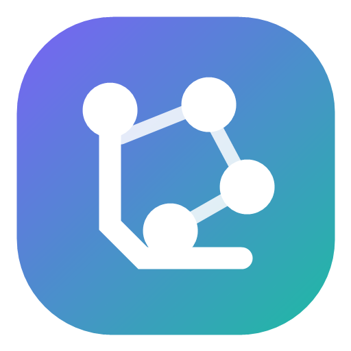
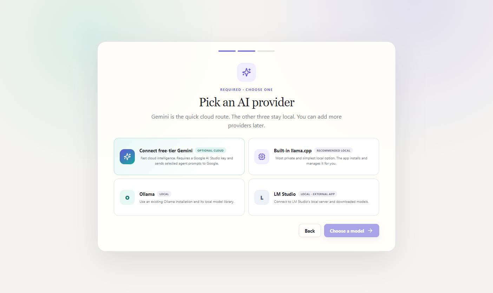

<p align="center">
  
</p>

<h1 align="center">Local Agent Studio</h1>

<p align="center">
  Build AI agents, connect them into visual workflows, and run them from one approachable Windows app.
</p>

<p align="center">
  
  
  
  
</p>

Local Agent Studio is a local-first multi-agent workflow builder for everyone—from people creating their first agent to developers prototyping private automation. It combines agent creation, model management, a visual workflow canvas, approvals, run history, and resource monitoring without asking users to assemble Python, Node.js, Docker, or several disconnected dashboards.

Use the built-in `llama.cpp` runtime, connect Ollama or LM Studio, or explicitly opt into Gemini 3.5 Flash. Local providers stay on the computer; cloud use is always a visible choice.



## Why this exists

Creating one useful agent should not require understanding runtimes, quantization, API servers, workflow schedulers, and half a dozen configuration formats first. Local Agent Studio turns that setup into a guided desktop experience while keeping the technical boundaries inspectable for advanced users.

- **One Windows application:** Electron, the backend, and the default runtime path are packaged together.
- **Local AI without the maze:** Hardware-aware guidance, model downloads, checksums, and safe defaults.
- **Visual multi-agent workflows:** Sequential agents, parallel branches, routers, reviews, functions, approvals, and outputs.
- **Understandable execution:** Watch each node move through pending, running, approval, completed, failed, or cancelled states.
- **Human control:** File writes, Word/Excel creation, email, and mutating HTTP requests require explicit approval tied to the exact action shown.
- **Practical integrations:** Attach documents or images to a run, configure email, create real `.docx` and `.xlsx` files, and attach reusable skill files to individual agents.
- **Permission layers:** Studio-wide master switches and per-agent permissions are both enforced by the backend for file, network, Python, MCP, and attachment access.
- **Portable designs:** Export `.agentpack` workflows without secrets, local paths, model files, or run history.
- **Honest provider choice:** Gemini is convenient but not local; the app says so before a key is connected.

## Choose how your agents think

| Provider | Best for | Setup |
| --- | --- | --- |
| Built-in llama.cpp | Maximum privacy and the fewest moving parts | Install the verified runtime and a GGUF model inside the app |
| Ollama | People who already use Ollama or want its model library | Open Ollama; the app detects it and can install the smallest starter model |
| LM Studio | People who manage models through the LM Studio desktop app | Start LM Studio's local API server and select a downloaded model |
| Gemini 3.5 Flash | Fast setup without downloading model weights | Create a Google AI Studio key through the guided opt-in flow |

The first-run wizard cannot finish until the selected provider has a runnable model. For local providers, Qwen 2.5 0.5B is offered as a small quick-start download.

## Try the current alpha

Windows 10 22H2 or Windows 11 x64 is required. A signed installer is a release goal; current alpha installers are unsigned and may trigger Microsoft SmartScreen.

1. Download the newest installer from [Releases](../../releases).
2. Open Local Agent Studio and review the private hardware assessment.
3. Choose Gemini, llama.cpp, Ollama, or LM Studio.
4. Connect/select at least one runnable model.
5. Create the sample studio and run **Research then write** from the Workflows page.

For the full non-technical walkthrough, see the [User Guide](docs/USER_GUIDE.md).

## What works today

- Hardware, RAM, VRAM, storage, and provider detection.
- Verified llama.cpp runtime installation without administrator privileges.
- Resumable curated GGUF downloads with license acknowledgement and checksum support.
- Agent creation with bounded context, answer length, instructions, and local memory.
- Visual workflow creation with live per-node progress and cancellation.
- Meaningful Approval, Function, Router, Review, Parallel, Input, and Output nodes.
- Curated file, document, HTTP, transformation, and email tools plus human approval nodes.
- Encrypted Gmail, Outlook, Yahoo, and custom SMTP setup with a real test-send flow.
- Native Word and Excel reading, searching, and approval-gated file creation.
- Per-agent Markdown, text, JSON, and YAML skill attachments encrypted at rest.
- Run-time document/image upload and approved local-path input with strict size limits.
- Optional Python functions and local stdio MCP tools behind Developer Mode,
  explicit agent authorization, and exact-action approval.
- Opt-in grounded Google Search for Gemini agents when both studio and agent
  web permissions are enabled; local agents can use explicit allowlisted HTTP
  workflow functions.
- AES-256-GCM protection for sensitive values with a master key protected by Windows DPAPI.
- Authenticated loopback backend and inference endpoints bound to `127.0.0.1`.
- Optional encrypted Gemini API-key storage and cloud execution blocked by Offline mode.
- SQLite-backed projects, agents, workflows, benchmarks, schedules, and run history.

## Security and privacy, plainly

Local-first does not mean every possible action is automatically safe.

- llama.cpp, Ollama, and LM Studio inference stays on loopback by default.
- Gemini prompts leave the computer only for agents explicitly assigned to Gemini.
- Google controls Gemini free-tier quotas and data-use terms; the app links to the current terms before connection.
- External HTTP and email tools can send data outside the computer and are permission-gated.
- SMTP passwords and agent skill files are encrypted locally and excluded from `.agentpack` exports.
- Arbitrary Python and MCP execution are disabled by default. Developer Mode
  requires a studio switch, an agent permission, and approval for every call;
  it is powerful but is not an operating-system sandbox.
- The alpha installer is not yet code-signed and automatic updates are not yet implemented.
- Model weights have their own licenses; “runs locally” does not necessarily mean “open source” or “commercially unrestricted.”

Read [SECURITY.md](SECURITY.md) for trust boundaries, reporting, and release requirements, and [DISCLAIMER.md](DISCLAIMER.md) for product-risk and backup guidance. Architecture details are in [docs/ARCHITECTURE.md](docs/ARCHITECTURE.md).

## Performance expectations

The first response includes model-loading time. A two-agent workflow invokes a model at least twice, so it is naturally slower than one chat response. The beginner defaults favor reliability on a 16 GB computer:

- 4,096-token working context;
- 128-token target response;
- 256-token hard output ceiling for ordinary agent nodes;
- one inference at a time when memory capacity is uncertain.

Use **Resources → Private benchmarks** to measure tokens per second and first-token latency on the actual computer. The 0.5B starter model proves the setup quickly; larger models usually produce better results.

Run monitoring uses a targeted lightweight endpoint rather than refreshing models and providers on every progress update. Hardware discovery is bounded and offers conservative defaults if Windows cannot report a device cleanly.

## Development

Contributor prerequisites:

- Windows 10 22H2 or Windows 11 x64
- Node.js 22+
- pnpm 11+
- Python 3.11 through 3.14

```powershell
python -m venv .venv
.\.venv\Scripts\python.exe -m pip install -r backend\requirements.txt
pnpm install
$env:LOCAL_AGENT_PYTHON = (Resolve-Path .\.venv\Scripts\python.exe)
pnpm dev
```

Clone the repository using GitHub's **Code** button, open PowerShell in that
folder, and then run the commands above.

Validation:

```powershell
pnpm typecheck
pnpm test
.\.venv\Scripts\python.exe -m pytest backend\tests -q
```

After packaging, validate the real frozen backend and Electron interface:

```powershell
.\scripts\smoke_packaged_backend.ps1
.\scripts\audit_packaged_ui.ps1
```

Build an unsigned local test installer:

```powershell
$env:LOCAL_AGENT_PYTHON = (Resolve-Path .\.venv\Scripts\python.exe)
pnpm package:win:unsigned
```

Production releases use `pnpm package:win` with a Windows code-signing certificate. Credentials, model weights, local databases, and generated installers do not belong in Git.

## Project map

```text
backend/             FastAPI service, providers, scheduler, tools, storage, and tests
build/               Canonical application icon used by the UI, tray, EXE, and installer
docs/                Beginner guide, architecture, and screenshots
scripts/             Reproducible build, packaging, SBOM, icon, and QA helpers
src/main/            Electron lifecycle, backend process, tray, and security boundaries
src/renderer/        React interface, workflow canvas, onboarding, and tests
vendor/llama.cpp/    Runtime destination; binaries are downloaded, never committed
```

## Contributing

Focused issues and pull requests are welcome. Start with [CONTRIBUTING.md](CONTRIBUTING.md), review the [Roadmap](ROADMAP.md), and keep privacy boundaries visible in every user flow.

## License

Local Agent Studio is licensed under [Apache-2.0](LICENSE). Third-party runtimes, applications, and model weights retain their own licenses; see [THIRD_PARTY_NOTICES.md](THIRD_PARTY_NOTICES.md). The software is provided without warranty; read [DISCLAIMER.md](DISCLAIMER.md), keep independent backups, and obtain qualified legal review before commercial distribution.
